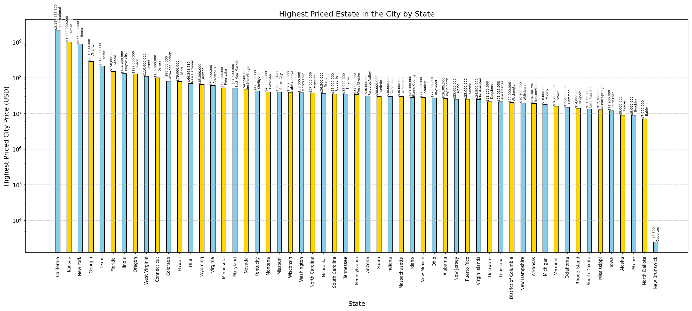

# usa-price-project
Real estate price analysis project for the cloud computing module using Hadoop.


# 🏡 USA Real Estate Price Analysis Using Hadoop MapReduce

This project analyzes a USA Real Estate dataset using Hadoop Streaming with Python-based MapReduce scripts. It calculates:

- 🏷️ Average house price by state  
- 💰 Highest-priced estate belonging city per state  

---

## 🚀 Setup Instructions

### 1️⃣ Install WSL and Ubuntu on Windows

Open PowerShell as Administrator:

```bash
wsl --install
```

After restart, launch Ubuntu and set up your username/password.


Update Ubuntu:

```bash
sudo apt update && sudo apt upgrade
```

---

### 2️⃣ Setup SSH (required by Hadoop)

```bash
sudo apt --assume-yes remove openssh-server
sudo apt --assume-yes install openssh-server
ssh-keygen -t rsa   
cat ~/.ssh/id_rsa.pub >> ~/.ssh/authorized_keys
chmod 600 ~/.ssh/authorized_keys
sudo service ssh start
ssh localhost
```

---

### 3️⃣ Install Java (Hadoop requirement)

```bash
sudo apt install openjdk-11-jdk
```

---

### 4️⃣ Download and Extract Hadoop

```bash
wget -c https://downloads.apache.org/hadoop/common/hadoop-3.4.1/hadoop-3.4.1.tar.gz
tar -xvzf hadoop-3.4.1.tar.gz
mv hadoop-3.4.1 ~/hadoop-3.4.1
```

---

### 5️⃣ Configure Hadoop

Edit configuration files under:

```bash
cd ~/hadoop-3.4.1/etc/hadoop
```

Edit these files with VSCode or nano:

- `core-site.xml`
```bash
 code etc/hadoop/core-site.xml
```

- `hdfs-site.xml`
```bash
 code etc/hadoop/hdfs-site.xml
```
- `mapred-site.xml`
```bash
 code etc/hadoop/mapred-site.xml
```
- `yarn-site.xml`
```bash
 code etc/hadoop/yarn-site.xml
```

🧩 Refer to official guide for config:  
[Apache Hadoop Single Node Setup](https://hadoop.apache.org/docs/current/hadoop-project-dist/hadoop-common/SingleCluster.html)

---

### 6️⃣ Update Environment Variables

Edit `~/.bashrc`:

```bash
code ~/.bashrc
```

Add at the end:

```bash
export JAVA_HOME=/usr/lib/jvm/java-11-openjdk-amd64
export HADOOP_HOME=~/hadoop-3.4.1
export PATH=$PATH:$HADOOP_HOME/bin:$HADOOP_HOME/sbin
export HADOOP_CONF_DIR=$HADOOP_HOME/etc/hadoop
export HADOOP_CLASSPATH=$JAVA_HOME/lib/tools.jar
```

Apply it:

```bash
source ~/.bashrc
```

Set `JAVA_HOME` in Hadoop:

```bash
code ~/hadoop-3.4.1/etc/hadoop/hadoop-env.sh
```

Add:

```bash
export JAVA_HOME=/usr/lib/jvm/java-11-openjdk-amd64
```

---

### 7️⃣ Format HDFS and Start Hadoop

```bash
cd ~/hadoop-3.4.1
bin/hdfs namenode -format
sbin/start-dfs.sh
sbin/start-yarn.sh
```

If you formatted previously, delete old datanode:

```bash
rm -rf /home/<your-username>/hadoopdata/hdfs/datanode/*
```

---

### 8️⃣ Clone the Project Repository

```bash
cd ~/
git clone https://github.com/HIRUNAHR/usa-price-project.git
cd usaprice
```

---

### 9️⃣ Prepare Python Virtual Environment

```bash
sudo apt install python3 python3-pip python3-venv
python3 -m venv venv
source venv/bin/activate
pip install matplotlib
```

Make scripts executable:

```bash
chmod +x run_hadoop.sh
chmod +x run_hadoop2.sh
chmod +x scripts/*.py
```

---

### 🔟 Upload Dataset & Run Jobs

#### Upload dataset to HDFS:

```bash
./run_hadoop.sh        # Runs the job of Average Price by State
./run_hadoop2.sh       # Runs the job of Highest Priced City per State
```

---

### 1️⃣1️⃣ Visualize Results

```bash
python visualizer.py      # Chart: average price by state
python visualizer2.py     # Chart: highest priced estate belonging city per state
```

PNG images saved to:
- `output/average_price_by_state.png`
- `output2/highest_priced_city_by_state.png`

---

### 1️⃣2️⃣ Access Hadoop Web Interfaces

Find your WSL IP:

```bash
hostname -I
```

Then open in your Windows browser:

- **HDFS NameNode UI**: http://localhost:9870  
- **YARN ResourceManager UI**: http://localhost:8088

---

### 1️⃣3️⃣ Shutdown and Cleanup

```bash
# Deactivate Python venv
deactivate

# Stop Hadoop
cd ~/hadoop-3.4.1
sbin/stop-dfs.sh
sbin/stop-yarn.sh

# Shutdown WSL
wsl --shutdown
```

---

## 📁 Project Structure

```
usa-real-estate-mapreduce/
├── data/                             # Realtor dataset (CSV)
├── output/                           # Output for average price
├── output2/                          # Output for highest priced city
├── scripts/
│   ├── mapper.py                     # For average price
│   ├── reducer.py
│   ├── mapper2.py                    # For max priced estate belonging city
│   └── reducer2.py
├── visualizer.py                     # Bar chart for average price
├── visualizer2.py                    # Bar chart for maximum priced estate belonging city
├── run_hadoop.sh
├── run_hadoop2.sh
└── README.md
```

---

## 📊 Sample Output

  

